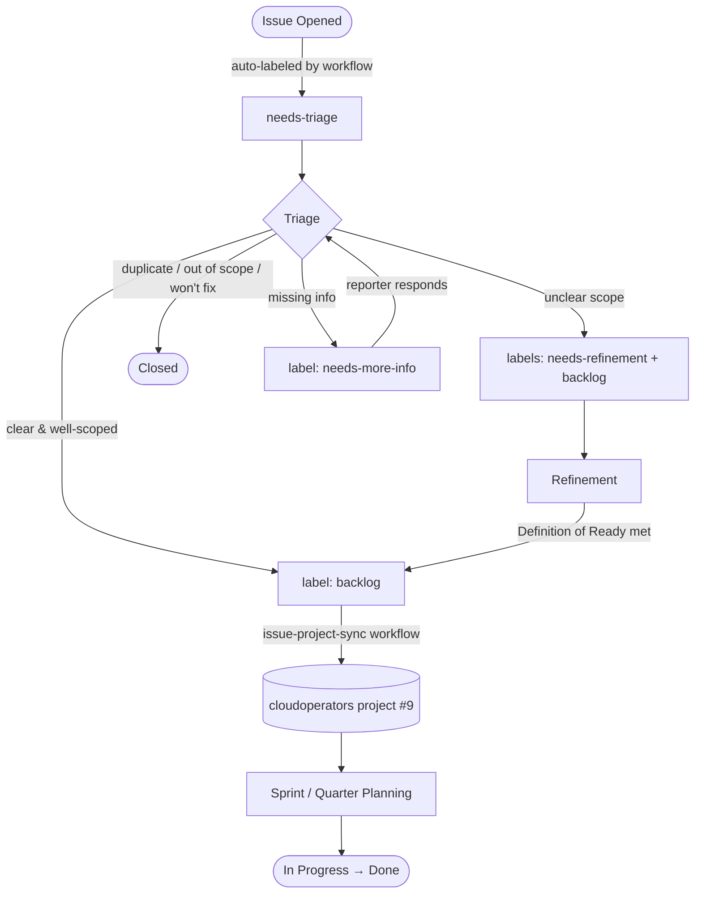

# Issue Lifecycle

This document defines the issue workflow used across all repositories in the `cloudoperators` organization.

## Overview

## Stages

### 1. Issue Opened → `needs-triage`

Every new issue is automatically labeled `needs-triage` by the `issue-triage` workflow. A welcome comment is posted directing the reporter to this document. No manual action is required from the reporter.

### 2. Triage (target: within 5 business days)

Maintainers review issues using the org-wide triage view:

🔗 **[All issues needing triage](https://github.com/issues?q=org%3Acloudoperators+label%3Aneeds-triage+is%3Aopen+sort%3Acreated-asc)**

A maintainer removes `needs-triage` and takes **exactly one** of these actions:

| Outcome | Action |
|---|---|
| Clear and well-scoped | Add label **`backlog`** — triggers automatic addition to the project |
| Unclear scope or missing acceptance criteria | Add label **`needs-refinement`** + add label **`backlog`** |
| Needs more info from reporter | Add label **`needs-more-info`** and post a comment specifying what is needed |
| Duplicate | Close with comment: "Duplicate of #NNN." |
| Out of scope / won't fix | Close with a short explanation comment |

**Rules:**
- Always remove `needs-triage` when taking action.
- Always post a comment when closing an issue.
- When adding `needs-more-info`, be specific — do not just say "more info needed".

### 3. Refinement → ready for implementation

Issues labeled `needs-refinement` are discussed asynchronously in comments or during a refinement session. Use the project refinement view for priority ordering:

🔗 **[Refinement view (project #9)](https://github.com/orgs/cloudoperators/projects/9/views/6)**

An issue meets the **Definition of Ready** when ALL of the following are true:

- [ ] Has a clear, single-sentence problem statement
- [ ] Has testable acceptance criteria (e.g., `- [ ] criterion`)
- [ ] Dependencies are identified (linked issues, or explicitly noted as none)

Once ready, the maintainer removes `needs-refinement`. The issue remains in the backlog, ready to be pulled into a sprint.

### 4. Backlog → Sprint / Quarter

During sprint or quarter planning, maintainers move issues from the backlog into the upcoming iteration. The `backlog` label is removed manually when an issue is assigned to a sprint or quarter.

## Label Reference

| Label | Applied by | Meaning |
|---|---|---|
| `needs-triage` | Automation (on open) | New issue, not yet reviewed |
| `needs-refinement` | Maintainer | Needs scoping before implementation |
| `needs-more-info` | Maintainer | Waiting on reporter for details |
| `backlog` | Maintainer | Ready for planning; triggers addition to project #9 |
| `bug` | Issue template | Regression or unintended behavior |
| `feature` | Issue template | New capability request |

## Repositories using this workflow

- [greenhouse](https://github.com/cloudoperators/greenhouse)
- [shoot-grafter](https://github.com/cloudoperators/shoot-grafter)
- [repo-guard](https://github.com/cloudoperators/repo-guard)
- [cloudctl](https://github.com/cloudoperators/cloudctl)
- [owner-label-injector](https://github.com/cloudoperators/owner-label-injector)

## Quick Links

| View | URL |
|---|---|
| All issues needing triage | [org-wide `needs-triage`](https://github.com/issues?q=org%3Acloudoperators+label%3Aneeds-triage+is%3Aopen+sort%3Acreated-asc) |
| Backlog (all repos) | [org-wide `backlog`](https://github.com/issues?q=org%3Acloudoperators+label%3Abacklog+is%3Aopen) |
| Needs refinement | [org-wide `needs-refinement`](https://github.com/issues?q=org%3Acloudoperators+label%3Aneeds-refinement+is%3Aopen) |
| Project board | [cloudoperators project #9](https://github.com/orgs/cloudoperators/projects/9) |
| Refinement view | [project #9, view 6](https://github.com/orgs/cloudoperators/projects/9/views/6) |